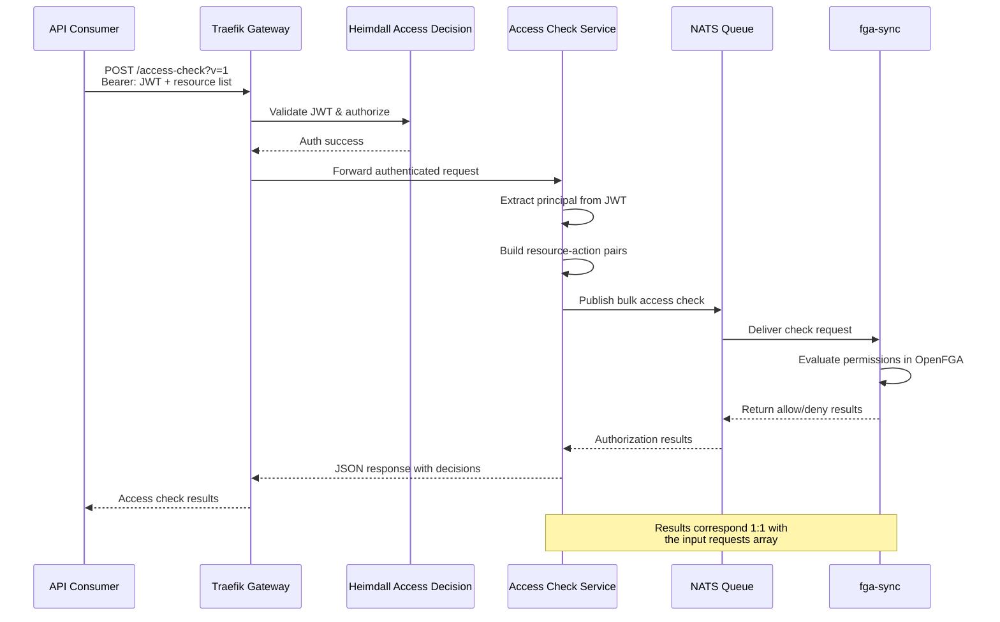

# LFX Access Check Service


An access check service for the LFX Self-Service platform, providing centralized authorization and permission management across LFX services.

## Key Features

- **Bulk Access Checks**: Process multiple resource-action permission checks in a single HTTP request
- **JWT Authentication**: Secure authentication using Heimdall-issued JWT tokens
- **Real-time Processing**: Asynchronous message processing via NATS, evaluated by fga-sync
- **Cloud Native**: Kubernetes-ready with Helm charts for easy deployment

## Architecture Overview


```mermaid
graph TB
    subgraph "LFX Self-Service Platform Gateway"
        T[Traefik<br/>API Gateway]
        H[Heimdall<br/>Access Decision Service]
    end

    subgraph "Access Check Service"
        AC[HTTP Server<br/>:8080]
        AS[Access Service<br/>Core Logic]
        HE[Health Endpoints<br/>/livez /readyz]
    end

    subgraph "Platform Infrastructure"
        N[NATS<br/>Message Queue]
        FGA[fga-sync<br/>Permission Evaluator]
    end

    T --> H
    H --> AC
    AC --> AS
    AC --> HE

    AS -->|publish bulk access check| N
    N -->|evaluate permissions| FGA
    FGA -->|return results| N
    N -->|authorization results| AS
```

## Access Check Flow


```mermaid
sequenceDiagram
    participant Client as API Consumer
    participant Traefik as Traefik Gateway
    participant Heimdall as Heimdall Access Decision
    participant AccessCheck as Access Check Service
    participant NATS as NATS Queue
    participant FGASync as fga-sync

    Client->>Traefik: POST /access-check?v=1<br/>Bearer: JWT + resource list
    Traefik->>Heimdall: Validate JWT & authorize
    Heimdall-->>Traefik: Auth success
    Traefik->>AccessCheck: Forward authenticated request

    AccessCheck->>AccessCheck: Extract principal from JWT
    AccessCheck->>AccessCheck: Build resource-action pairs
    AccessCheck->>NATS: Publish bulk access check

    NATS->>FGASync: Deliver check request
    FGASync->>FGASync: Evaluate permissions in OpenFGA
    FGASync-->>NATS: Return allow/deny results

    NATS-->>AccessCheck: Authorization results
    AccessCheck-->>Traefik: JSON response with decisions
    Traefik-->>Client: Access check results

    Note over AccessCheck,FGASync: Results correspond 1:1 with<br/>the input requests array
```

## Quick Start

### Prerequisites

- **Go**: 1.24.0+
- **Docker**: For containerized deployment
- **NATS**: Message queue for service communication
- **fga-sync**: Permission evaluator (processes access check messages from NATS)
- **Heimdall**: JWT authentication provider

### Local Development

1. **Clone the repository**

   ```bash
   git clone https://github.com/linuxfoundation/lfx-v2-access-check.git
   cd lfx-v2-access-check
   ```

2. **Install dependencies**

   ```bash
   make deps
   ```

3. **Generate API code** (if needed)

   ```bash
   make apigen
   ```

4. **Build the service**

   ```bash
   make build
   ```

5. **Run tests**

   ```bash
   make test
   ```

6. **Start the service**

   ```bash
   ./bin/lfx-access-check
   ```

Run `make help` to see all available targets, including linting, coverage, Docker, and Helm commands.

### Configuration

The service is configured via environment variables:

| Variable | Description | Default |
|----------|-------------|---------|
| `HOST` | Server host address | `0.0.0.0` |
| `PORT` | Server port | `8080` |
| `DEBUG` | Enable debug logging | `false` |
| `JWKS_URL` | Heimdall JWKS endpoint | `http://heimdall:4457/.well-known/jwks` |
| `AUDIENCE` | JWT audience | `lfx-v2-access-check` |
| `ISSUER` | JWT issuer | `heimdall` |
| `NATS_URL` | NATS server URL | `nats://nats:4222` |

## API Reference

### Check Access

```
POST /access-check?v=1
Authorization: Bearer <JWT_TOKEN>
Content-Type: application/json
```

**Request body:**

```json
{
  "requests": [
    "project:123#read",
    "committee:456#write"
  ]
}
```

**Response:** Results are returned in the same order as the input `requests` array.

```json
{
  "results": [
    "allow",
    "deny"
  ]
}
```

Each result is either `"allow"` or `"deny"`. The resource-action pair format is `{type}:{id}#{action}`.

### Health Endpoints

- `GET /livez` — Liveness probe (basic service health)
- `GET /readyz` — Readiness probe (service + dependencies)

### OpenAPI Spec

The service serves its own OpenAPI spec at:

- `/_access-check/openapi.json`
- `/_access-check/openapi.yaml`
- `/_access-check/openapi3.json`
- `/_access-check/openapi3.yaml`

## Architecture Details

### Core Components

1. **HTTP Server** (`cmd/lfx-access-check/`)
   - Goa-based REST API server
   - JWT authentication middleware
   - Request ID tracking
   - Structured logging

2. **Access Service** (`internal/service/`)
   - Core business logic
   - JWT token validation
   - NATS message publishing
   - Response aggregation

3. **Infrastructure Layer** (`internal/infrastructure/`)
   - **Auth Repository**: Heimdall JWT validation
   - **Messaging Repository**: NATS communication
   - **Config**: Environment-based configuration

4. **Domain Contracts** (`internal/domain/contracts/`)
   - Shared data structures
   - JWT claims modeling
   - Service interfaces

### Project Structure

```
├── cmd/lfx-access-check/    # Application entry point
├── design/                  # Goa API design definitions
├── gen/                     # Generated API code (Goa) — do not edit
├── internal/
│   ├── container/          # Dependency injection
│   ├── domain/contracts/   # Domain models & interfaces
│   ├── infrastructure/     # External service adapters
│   ├── middleware/         # HTTP middleware
│   ├── service/           # Core business logic
│   └── mocks/             # Test mocks
├── pkg/
│   ├── constants/         # Application constants
│   └── log/              # Structured logging utilities
├── test/integration/      # Integration tests
└── charts/               # Helm deployment charts
```

## Testing

### Unit Tests

```bash
make test
```

### Integration Tests

Integration tests are in `test/integration/` and use mock dependencies — no external services required.

```bash
go test -v ./test/integration/
```

### Coverage Report

```bash
make test-coverage   # generates coverage.html
```

## Deployment

### Docker

The production image is published to GHCR. Available tags:

| Tag | Published when |
|-----|---------------|
| `latest` | On every tagged release |
| `vX.Y.Z` | On every tagged release (e.g. `v0.2.8`) |
| `<commit-sha>` | On every merge to `main` and every open PR |
| `development` | On every merge to `main` |

Browse all published tags at: `https://github.com/linuxfoundation/lfx-v2-access-check/pkgs/container/lfx-v2-access-check%2Flfx-access-check`

```bash
docker run -p 8080:8080 ghcr.io/linuxfoundation/lfx-v2-access-check/lfx-access-check:latest
```

To build and run locally from source:

```bash
make docker-build
make docker-run
```

### Kubernetes with Helm

```bash
make helm-install
```

This installs using the committed `values.yaml`. For local development, you can override values without modifying `values.yaml`. Copy the example file and customize it:

```bash
cp charts/lfx-v2-access-check/values.local.example.yaml charts/lfx-v2-access-check/values.local.yaml
```

`values.local.yaml` is gitignored. Edit it with any overrides you need (e.g. image tag, replica count), then use the local make targets:

```bash
# Install using your local values file
make helm-install-local

# Preview rendered templates with your local values
make helm-templates-local
```

## License

This project is licensed under the MIT License - see the [LICENSE](LICENSE) file for details.
