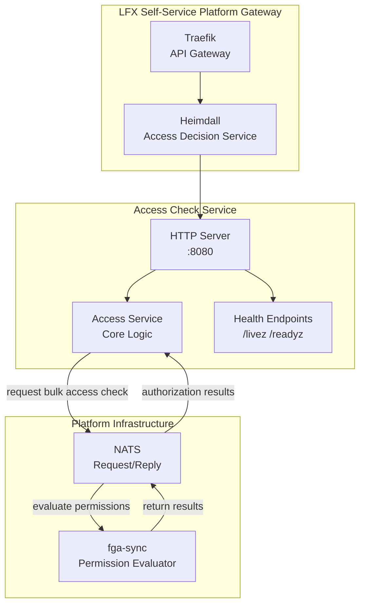
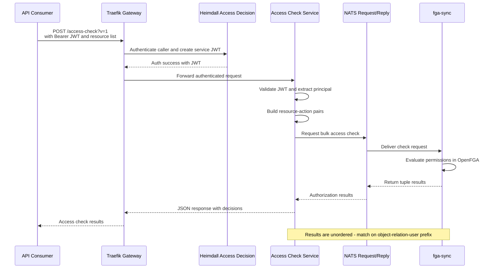

# LFX Access Check Service


An HTTP access-check wrapper for the LFX Self-Service platform. It validates Heimdall-issued JWTs, forwards access-check requests to `lfx-v2-fga-sync` over NATS request/reply, and returns the resulting permission decisions.

## Key Features

- **Bulk Access Checks**: Process multiple resource-action permission checks in a single HTTP request
- **JWT Authentication**: Secure authentication using Heimdall-issued JWT tokens
- **Real-time Processing**: Synchronous NATS request/reply calls evaluated by fga-sync
- **Cloud Native**: Kubernetes-ready with Helm charts for easy deployment

## Architecture Overview


```mermaid
graph TB
    subgraph "LFX Self-Service Platform Gateway"
        T[Traefik<br/>API Gateway]
        H[Heimdall<br/>Access Decision Service]
    end

    subgraph "Access Check Service"
        AC[HTTP Server<br/>:8080]
        AS[Access Service<br/>Core Logic]
        HE[Health Endpoints<br/>/livez /readyz]
    end

    subgraph "Platform Infrastructure"
        N[NATS<br/>Request/Reply]
        FGA[fga-sync<br/>Permission Evaluator]
    end

    T --> H
    H --> AC
    AC --> AS
    AC --> HE

    AS -->|request bulk access check| N
    N -->|evaluate permissions| FGA
    FGA -->|return results| N
    N -->|authorization results| AS
```

## Access Check Flow


```mermaid
sequenceDiagram
    participant Client as API Consumer
    participant Traefik as Traefik Gateway
    participant Heimdall as Heimdall Access Decision
    participant AccessCheck as Access Check Service
    participant NATS as NATS Request/Reply
    participant FGASync as fga-sync

    Client->>Traefik: POST /access-check?v=1<br />with Bearer JWT and resource list
    Traefik->>Heimdall: Authenticate caller and create service JWT
    Heimdall-->>Traefik: Auth success with JWT
    Traefik->>AccessCheck: Forward authenticated request

    AccessCheck->>AccessCheck: Validate JWT and extract principal
    AccessCheck->>AccessCheck: Build resource-action pairs
    AccessCheck->>NATS: Request bulk access check

    NATS->>FGASync: Deliver check request
    FGASync->>FGASync: Evaluate permissions in OpenFGA
    FGASync-->>NATS: Return tuple results

    NATS-->>AccessCheck: Authorization results
    AccessCheck-->>Traefik: JSON response with decisions
    Traefik-->>Client: Access check results

    Note over AccessCheck,FGASync: Results are unordered - match on object-relation-user prefix
```

## Quick Start

### Prerequisites

- **Go**: 1.24.0+
- **Docker**: For containerized deployment
- **NATS**: Request/reply transport for access-check calls
- **fga-sync**: Permission evaluator with responders for `lfx.access_check.request` and `lfx.access_check.read_tuples`
- **Heimdall**: Authentication provider and JWT finalizer

### Local Development

1. **Clone the repository**

   ```bash
   git clone https://github.com/linuxfoundation/lfx-v2-access-check.git
   cd lfx-v2-access-check
   ```

2. **Install dependencies**

   ```bash
   make deps
   ```

3. **Generate API code** (if needed)

   ```bash
   make apigen
   ```

4. **Build the service**

   ```bash
   make build
   ```

5. **Run tests**

   ```bash
   make test
   ```

6. **Start the service**

   ```bash
   ./bin/lfx-access-check
   ```

Run `make help` to see all available targets, including linting, coverage, Docker, and Helm commands.

### Configuration

The service is configured via environment variables:

| Variable | Description | Default |
|----------|-------------|---------|
| `HOST` | Server host address | `0.0.0.0` |
| `PORT` | Server port | `8080` |
| `DEBUG` | Enable debug logging | `false` |
| `LOG_LEVEL` | Structured log level (`debug`, `info`, `warn`) | `debug` |
| `LOG_ADD_SOURCE` | Include source file data in structured logs | `false` |
| `JWKS_URL` | Heimdall JWKS endpoint | `http://heimdall:4457/.well-known/jwks` |
| `AUDIENCE` | JWT audience | `lfx-v2-access-check` |
| `ISSUER` | JWT issuer | `heimdall` |
| `NATS_URL` | NATS server URL | `nats://nats:4222` |

## API Reference

> **Source of truth:** [`docs/access-check-contract.md`](docs/access-check-contract.md) is authoritative for the HTTP surface (request, response, error mapping, timeout semantics, OpenAPI paths). The snippets below are a convenience overview; if they ever drift from the contract doc, the contract doc wins.

### Check Access

```
POST /access-check?v=1
Authorization: Bearer <JWT_TOKEN>
Content-Type: application/json
```

**Request body:**

```json
{
  "requests": [
    "project:a27394a3-7a6c-4d0f-9e0f-692d8753924f#auditor",
    "committee:b3c72e18-1a2b-4c3d-8e9f-123456789abc#writer"
  ]
}
```

**Response:** Results are unordered — match on the `object#relation@user` prefix of each result to correlate with your requests.

```json
{
  "results": [
    "project:a27394a3-7a6c-4d0f-9e0f-692d8753924f#auditor@user:auth0|alice\ttrue",
    "committee:b3c72e18-1a2b-4c3d-8e9f-123456789abc#writer@user:auth0|alice\tfalse"
  ]
}
```

Each result is a tab-separated string: `object#relation@user\ttrue` or `object#relation@user\tfalse`. The resource-action pair format is `{type}:{id}#{relation}`.

### My Grants

```
GET /my-grants?v=1&object_type=project
Authorization: Bearer <JWT_TOKEN>
```

Returns direct grants for the caller by object type, via fga-sync's
`lfx.access_check.read_tuples` request/reply contract. It does not expand
inherited access from parent resources.

### Health Endpoints

- `GET /livez` — Liveness probe (basic service health)
- `GET /readyz` — Readiness probe (service + dependencies)

### OpenAPI Spec

The service serves its own OpenAPI spec at:

- `/_access-check/openapi.json`
- `/_access-check/openapi.yaml`
- `/_access-check/openapi3.json`
- `/_access-check/openapi3.yaml`

## Architecture Details

### Core Components

1. **HTTP Server** (`cmd/lfx-access-check/`)
   - Goa-based REST API server
   - JWT authentication middleware
   - Request ID tracking
   - Structured logging

2. **Access Service** (`internal/service/`)
   - Core business logic
   - JWT token validation
   - NATS request/reply communication
   - Response aggregation

3. **Infrastructure Layer** (`internal/infrastructure/`)
   - **Auth Repository**: Heimdall JWT validation
   - **Messaging Repository**: NATS communication
   - **Config**: Environment-based configuration

4. **Domain Contracts** (`internal/domain/contracts/`)
   - Shared data structures
   - JWT claims modeling
   - Service interfaces

### Project Structure

```
├── cmd/lfx-access-check/    # Application entry point
├── design/                  # Goa API design definitions
├── gen/                     # Generated API code (Goa) — do not edit
├── internal/
│   ├── container/          # Dependency injection
│   ├── domain/contracts/   # Domain models & interfaces
│   ├── infrastructure/     # External service adapters
│   ├── middleware/         # HTTP middleware
│   ├── service/           # Core business logic
│   └── mocks/             # Test mocks
├── pkg/
│   ├── constants/         # Application constants
│   └── log/              # Structured logging utilities
├── test/integration/      # Integration tests
└── charts/               # Helm deployment charts
```

## Testing

### Unit Tests

```bash
make test
```

### Integration Tests

Integration tests are in `test/integration/` and use mock dependencies — no external services required.

```bash
go test -v ./test/integration/
```

### Coverage Report

```bash
make test-coverage   # generates coverage.html
```

## Deployment

### Docker

The production image is published to GHCR. Available tags:

| Tag | Published when |
|-----|---------------|
| `latest` | On every tagged release |
| `vX.Y.Z` | On every tagged release (e.g. `v0.2.8`) |
| `<commit-sha>` | On every merge to `main` and every open PR |
| `development` | On every merge to `main` |
| `<branch-name>` | On every open PR (special characters replaced with `-`, e.g. `my-feature-branch`) |

Browse all published tags at: `https://github.com/linuxfoundation/lfx-v2-access-check/pkgs/container/lfx-v2-access-check%2Flfx-access-check`

```bash
docker run -p 8080:8080 ghcr.io/linuxfoundation/lfx-v2-access-check/lfx-access-check:latest
```

To build and run locally from source:

```bash
make docker-build
make docker-run
```

### Kubernetes with Helm

```bash
make helm-install
```

This installs using the committed `values.yaml`. For local development, you can override values without modifying `values.yaml`. Copy the example file and customize it:

```bash
cp charts/lfx-v2-access-check/values.local.example.yaml charts/lfx-v2-access-check/values.local.yaml
```

`values.local.yaml` is gitignored. Edit it with any overrides you need (e.g. image tag, replica count), then use the local make targets:

```bash
# Install using your local values file
make helm-install-local

# Preview rendered templates with your local values
make helm-templates-local
```

## License

This project is licensed under the MIT License - see the [LICENSE](LICENSE) file for details.
