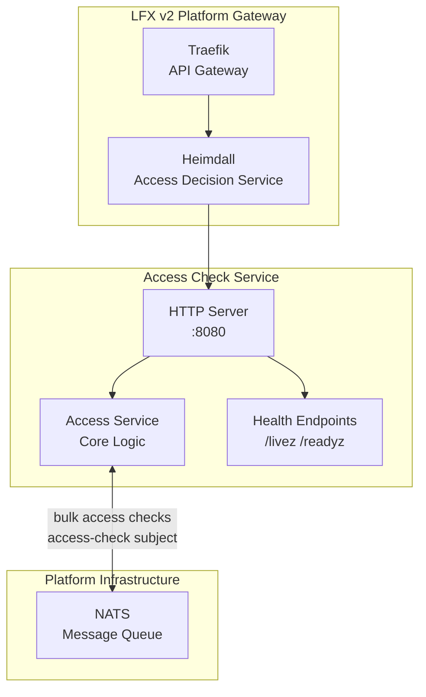
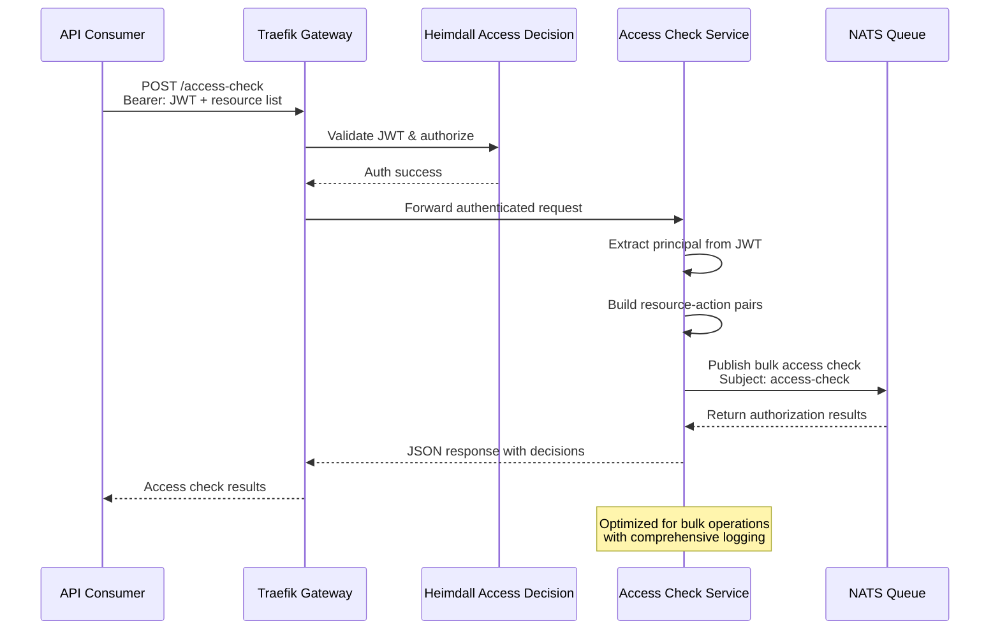

# LFX v2 Access Check Service


A access check service for the LFX v2 platform, providing centralized authorization and permission management across LFX services.

## ✨ Key Features

- **🚀 Bulk Access Checks**: Process multiple resource-action permission checks in a single HTTP request
- **🔐 JWT Authentication**: Secure authentication using Heimdall-issued JWT tokens
- **🔄 Real-time Processing**: Asynchronous message processing via NATS queue
- **🚢 Cloud Native**: Kubernetes-ready with Helm charts for easy deployment

## 🏗️ Architecture Overview



## 🔄 Access Check Flow



## 🚀 Quick Start

### Prerequisites

- **Go**: 1.24.0 
- **Docker**: For containerized deployment
- **NATS**: Message queue for service communication
- **Heimdall**: JWT authentication provider

### Local Development

1. **Clone the repository**
   ```bash
   git clone https://github.com/linuxfoundation/lfx-v2-access-check.git
   cd lfx-v2-access-check
   ```

2. **Install dependencies**
   ```bash
   make deps
   ```

3. **Generate API code** (if needed)
   ```bash
   make apigen
   ```

4. **Build the service**
   ```bash
   make build
   ```

5. **Run tests**
   ```bash
   make test
   ```

6. **Start the service**
   ```bash
   ./bin/lfx-access-check
   ```

### Configuration

The service is configured via environment variables:

| Variable | Description | Default |
|----------|-------------|---------|
| `HOST` | Server host address | `0.0.0.0` |
| `PORT` | Server port | `8080` |
| `DEBUG` | Enable debug logging | `false` |
| `JWKS_URL` | Heimdall JWKS endpoint | `http://heimdall:4457/.well-known/jwks` |
| `AUDIENCE` | JWT audience | `lfx-v2-access-check` |
| `ISSUER` | JWT issuer | `heimdall` |
| `NATS_URL` | NATS server URL | `nats://nats:4222` |

### Docker Deployment

```bash
# Build image
make docker-build

# Run container
docker run -p 8080:8080 \
  -e JWKS_URL=http://heimdall:4457/.well-known/jwks \
  -e NATS_URL=nats://nats:4222 \
  linuxfoundation/lfx-access-check:latest
```

### Health Endpoints

- **Liveness**: `GET /livez` - Basic service health
- **Readiness**: `GET /readyz` - Service + dependencies health

## 🏛️ Architecture Details

### Core Components

1. **HTTP Server** (`cmd/lfx-access-check/`)
   - Goa-based REST API server
   - JWT authentication middleware
   - Request ID tracking
   - Structured logging

2. **Access Service** (`internal/service/`)
   - Core business logic
   - JWT token validation
   - NATS message publishing
   - Response aggregation

3. **Infrastructure Layer** (`internal/infrastructure/`)
   - **Auth Repository**: Heimdall JWT validation
   - **Messaging Repository**: NATS communication
   - **Config**: Environment-based configuration

4. **Domain Contracts** (`internal/domain/contracts/`)
   - Shared data structures
   - JWT claims modeling
   - Service interfaces

### Project Structure

```
├── cmd/lfx-access-check/    # Application entry point
├── design/                  # Goa API design definitions
├── gen/                     # Generated API code (Goa)
├── internal/
│   ├── container/          # Dependency injection
│   ├── domain/contracts/   # Domain models & interfaces
│   ├── infrastructure/     # External service adapters
│   ├── middleware/         # HTTP middleware
│   ├── service/           # Core business logic
│   └── mocks/             # Test mocks
├── pkg/
│   ├── constants/         # Application constants
│   └── log/              # Structured logging utilities
├── test/integration/      # Integration tests
└── charts/               # Helm deployment charts
```

## 🚢 Deployment

### Kubernetes with Helm

```bash
# Install/upgrade with Helm
helm upgrade --install lfx-v2-access-check ./charts/lfx-v2-access-check \
  --set image.tag=latest \
  --set config.jwksUrl=http://heimdall:4457/.well-known/jwks \
  --set config.natsUrl=nats://nats:4222
```

## 📄 License

This project is licensed under the MIT License - see the [LICENSE](LICENSE) file for details.

